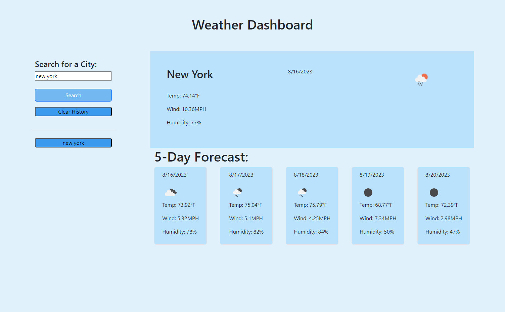

# weather-app

## Description

The purpose of this assignment is to familiarize the use of server side API's. We used a weather API and learned to use it to fetch information. 

## Usage 

<ul>
    <li>The user is able to use the search box to find a city</li>
    <li>The site will display the current weather for the searched city</li>   
</ul>

<ul>
    <li>
        <a href="https://github.com/Soleiles/weather-app">Repository</a>
    </li>
    <li>
        <a href="https://soleiles.github.io/weather-app/">Live Site</a>
    </li>
</ul>

## License

Refer to license in the repository.